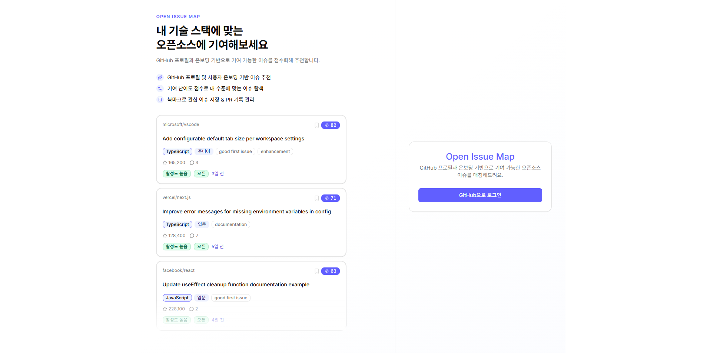
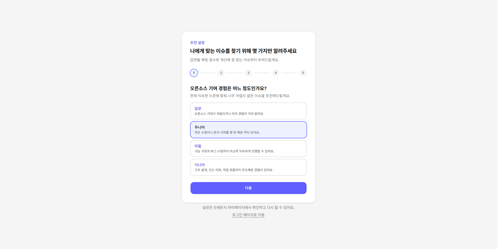
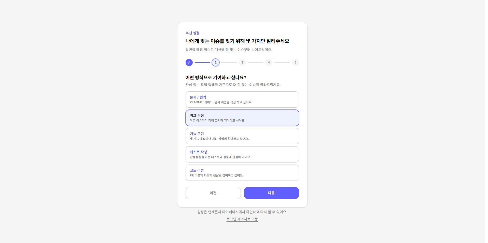
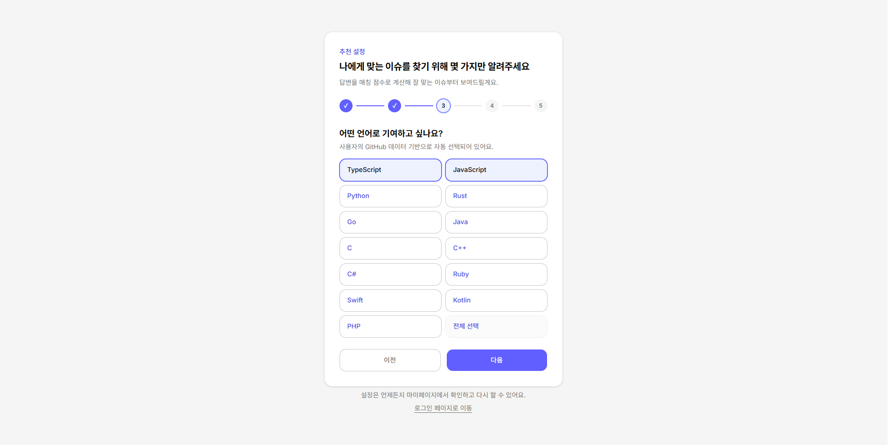
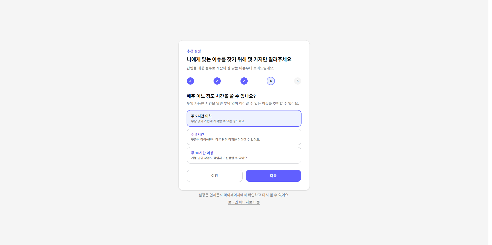
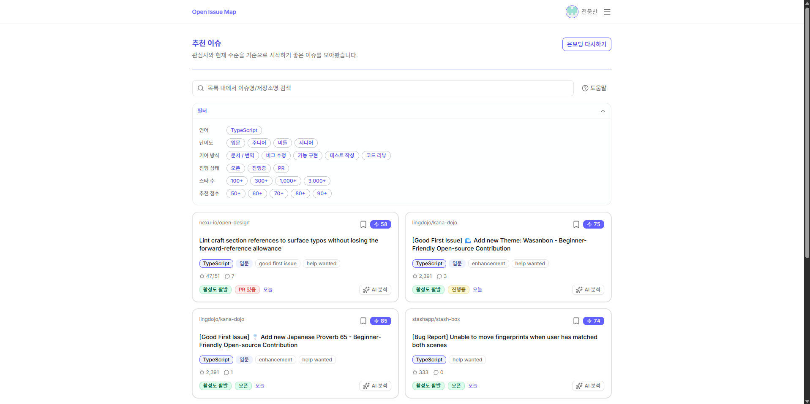
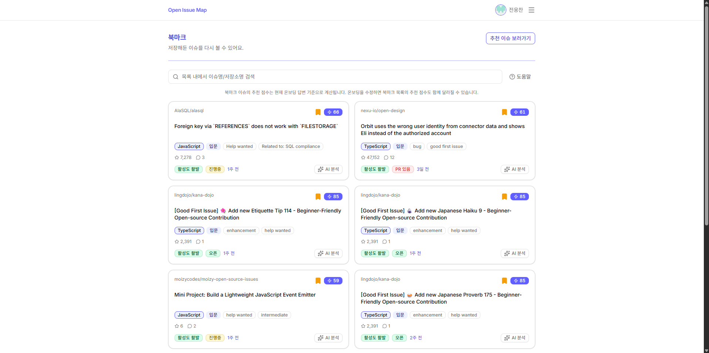
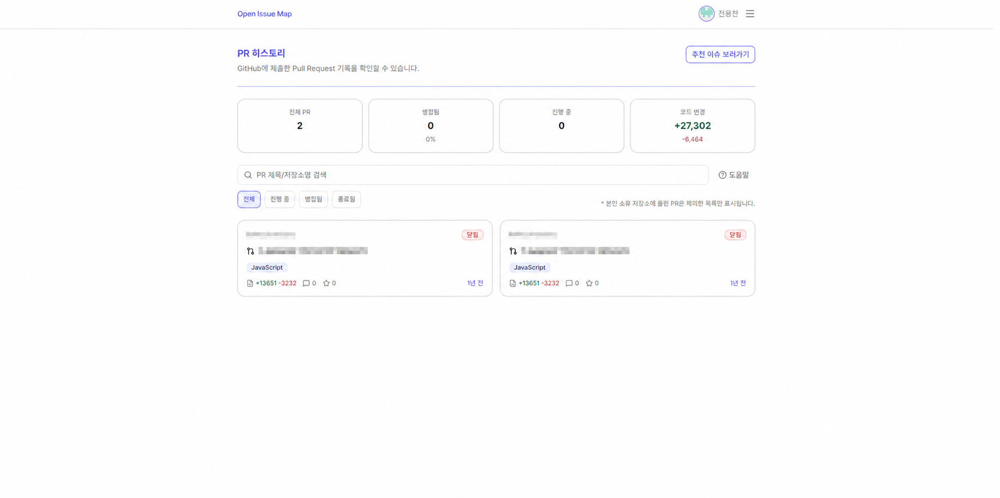
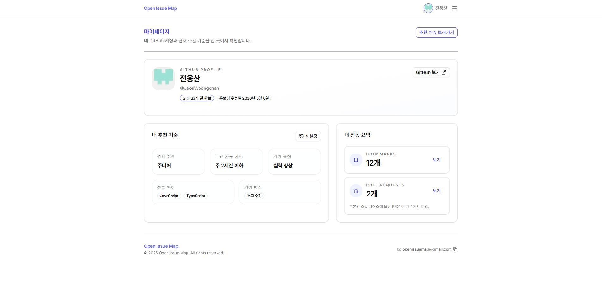

# Open Issue Map

> GitHub 프로필과 온보딩 설문을 기반으로, 지금 기여하기 좋은 오픈소스 이슈를 추천하고 관심 이슈와 PR 활동을 한 화면에서 관리하는 서비스입니다.

**서비스 바로가기:** [https://openissuemap.com](https://openissuemap.com)

---

## 한눈에 보기

Open Issue Map은 “오픈소스에 기여하고 싶지만 어디서 시작할지 모르는 사용자”를 위한 추천 서비스입니다.

사용자는 GitHub 계정으로 로그인한 뒤 경험 수준, 선호 언어, 관심 기여 방식, 주간 투입 가능 시간, 기여 목적을 입력합니다. 서비스는 GitHub 이슈 후보를 가져와 사용자 프로필과 이슈 메타데이터를 비교하고, 매칭 점수와 함께 추천 목록을 제공합니다.

핵심 기능은 네 가지입니다.

- **맞춤 이슈 추천:** 언어, 난이도, 기여 유형, 경쟁도, 작업 시간, 목적, 저장소 건강도를 반영해 이슈를 점수화합니다.
- **이슈 필터링:** 추천 점수, 언어, 난이도, 기여 유형, 스타 수 조건으로 후보를 좁힙니다.
- **북마크:** 관심 이슈를 저장하고 GitHub 조회 실패 시에도 DB에 저장된 정보로 fallback 표시합니다.
- **PR 히스토리:** 사용자가 외부 저장소에 제출한 PR과 additions/deletions 통계를 확인합니다.

---

## 화면별 설명

### 1. 로그인

> 

- GitHub OAuth로 서비스를 시작하는 진입 화면입니다.
- 데스크톱에서는 서비스 소개와 추천 이슈 예시를 함께 보여주고, 모바일에서는 로그인 행동이 밀리지 않도록 소개 문구를 간결하게 분리했습니다.
- 인증은 NextAuth GitHub Provider를 사용하며, 로그인 후 `/dashboard`로 이동합니다.

### 2. 온보딩

> 
> 
> 
> 
> 


- 사용자의 추천 기준을 수집하는 설문 화면입니다.
- 경험 수준, 기여 유형, 선호 언어, 주간 가능 시간, 기여 목적을 선택합니다.
- GitHub 저장소 언어 정보를 best-effort로 가져와 초기 언어 후보를 구성합니다.

### 3. 추천 이슈 대시보드

> 


- 온보딩 프로필 기반으로 추천 이슈를 보여주는 핵심 화면입니다.
- 카드에는 저장소, 제목, 라벨, 댓글 수, 스타 수, 추천 점수, 저장소 건강도 등이 표시됩니다.
- 필터가 강해 결과가 부족할 때는 자동으로 오래 기다리게 하지 않고, 사용자가 직접 다음 후보를 더 조회하도록 안내합니다.

### 4. 북마크

> 


- 관심 이슈를 저장하고 다시 확인하는 화면입니다.
- 저장 시점의 이슈 제목과 URL을 DB에 보관해 GitHub API 장애 상황에서도 최소한의 목록 확인이 가능합니다.
- 북마크 토글은 낙관적 업데이트로 즉시 반응하도록 구성했습니다.

### 5. PR 히스토리

> 

- 사용자가 외부 저장소에 제출한 PR 이력을 보여줍니다.
- 본인 소유 저장소 PR은 제외해 실제 오픈소스 기여 활동을 중심으로 봅니다.
- additions는 초록색, deletions는 빨간색으로 표시해 변경 규모를 빠르게 파악할 수 있습니다.

### 6. 마이페이지

> 


- GitHub 계정 정보, 온보딩 설정, 북마크/PR 활동 요약을 확인하는 화면입니다.
- 사용자가 추천 기준을 다시 이해하고 활동 상태를 점검할 수 있도록 구성했습니다.

---

## 기술 스택과 선택 이유

| 영역 | 사용 기술 | 선택 이유 |
| --- | --- | --- |
| Framework | Next.js 15 App Router | 서버 컴포넌트, Route Handler, 인증 보호 layout을 한 애플리케이션 안에서 분리하기 위해 사용했습니다. |
| UI | React 19, Tailwind CSS v4, shadcn/ui, Radix UI, lucide-react | 접근성 있는 primitive와 디자인 토큰 기반 스타일링으로 빠르게 일관된 UI를 만들기 위해 선택했습니다. |
| Language | TypeScript strict | GitHub API 응답, 내부 API 계약, 추천 점수 모델처럼 데이터 형태가 중요한 영역에서 런타임 오류를 줄이기 위해 사용했습니다. |
| Auth | NextAuth v5 beta, GitHub OAuth | GitHub 계정 기반 로그인과 GitHub API access token 확보가 모두 필요해 OAuth 기반 인증을 사용했습니다. |
| Database | Neon PostgreSQL | 사용자, 온보딩 프로필, 북마크, repo health cache처럼 관계가 명확한 데이터를 서버리스 PostgreSQL로 관리하기 위해 선택했습니다. |
| Server State | TanStack Query v5 | 추천 이슈, 북마크, PR 이력의 pagination, cache, mutation 상태를 클라이언트에서 일관되게 관리하기 위해 사용했습니다. |
| Validation | Zod v4 | Route Handler의 body/query를 명시적으로 검증해 잘못된 요청이 도메인 로직까지 들어오지 않게 했습니다. |
| Test | Vitest | 추천 점수, 필터, Route Handler, 인증 유틸처럼 회귀 위험이 큰 로직을 빠르게 검증하기 위해 사용했습니다. |

---

## 아키텍처

Open Issue Map은 Next.js 단일 애플리케이션 안에서 화면, API, 도메인 로직, 외부 연동 책임을 분리합니다.

```text
Browser
  └─ App Router Pages / Client Components
       └─ Hooks + TanStack Query
            └─ Route Handlers (BFF)
                 ├─ Domain Services
                 │    ├─ Recommendation / Scoring
                 │    ├─ Bookmarks
                 │    ├─ User Profile
                 │    └─ Pull Requests
                 ├─ GitHub REST / GraphQL API
                 └─ Neon PostgreSQL
```

### 계층을 나눈 이유

- **App Router / Layout:** 로그인 여부와 온보딩 완료 여부를 서버에서 먼저 판단해 보호가 필요한 화면 접근을 차단합니다.
- **Route Handler:** 클라이언트가 GitHub token이나 DB에 직접 접근하지 않도록 내부 BFF 역할을 합니다.
- **Domain Service:** 추천 점수, repo health, PR 이력 가공, 북마크 fallback처럼 테스트가 필요한 로직을 UI와 분리했습니다.
- **Client Hooks:** TanStack Query key, infinite query, mutation, optimistic update를 화면 컴포넌트에서 분리했습니다.

자세한 구조는 [docs/ARCHITECTURE.md](./docs/ARCHITECTURE.md), 디렉터리 책임은 [docs/FOLDER_STRUCTURE.md](./docs/FOLDER_STRUCTURE.md)에 정리했습니다.

---

## 추천 시스템 설계

GitHub Issue는 “이 이슈가 어떤 사용자에게 적합한지”를 직접 알려주지 않습니다. 그래서 이 서비스는 GitHub에서 가져온 이슈 후보를 사용자 온보딩 프로필과 비교해 점수화합니다.

추천 흐름은 다음과 같습니다.

1. 온보딩 프로필을 로드합니다.
2. 선호 언어를 기준으로 GitHub issue 후보를 조회합니다.
3. 중복 이슈를 제거합니다.
4. 저장소 건강도(repo health)를 조회하거나 캐시에서 가져옵니다.
5. 이슈 라벨, 제목, 본문, 댓글 수, 연결 PR 여부, 저장소 정보를 기반으로 점수를 계산합니다.
6. 사용자 필터를 적용하고 안정적인 정렬 순서로 반환합니다.

점수에 반영하는 주요 차원은 다음과 같습니다.

- 선호 언어와 저장소 primary language 일치도
- 경험 수준과 추정 난이도 적합도
- 관심 기여 유형과 이슈 성격 적합도
- 댓글 수와 연결 PR 여부 기반 경쟁도
- 주간 가능 시간과 작업 크기의 적합도
- 포트폴리오, 성장, 커뮤니티 목적별 가중치
- 저장소 최근 커밋, PR 응답 속도, merge rate 기반 repo health

추천 규칙의 상세 기준은 [docs/SCORING_RULES.md](./docs/SCORING_RULES.md)에 정리했습니다.

---

## 인증과 보안 설계

GitHub access token은 클라이언트에 노출하지 않습니다.

- GitHub OAuth 로그인은 NextAuth가 처리합니다.
- 서버는 HttpOnly JWT 쿠키를 기반으로 session을 생성합니다.
- GitHub API가 필요한 Route Handler는 `requireGithubToken(req)`를 통해 서버에서 token을 꺼냅니다.
- 클라이언트는 내부 API만 호출하고, GitHub API와 DB에는 직접 접근하지 않습니다.

이 구조를 선택한 이유는 GitHub token이 브라우저 번들, localStorage, API 응답에 노출되는 위험을 줄이기 위해서입니다.

---

## 데이터 모델

현재 DB는 Neon PostgreSQL을 사용하며 핵심 테이블은 네 개입니다.

| 테이블 | 역할 | 설계 이유 |
| --- | --- | --- |
| `users` | GitHub OAuth 사용자 기본 정보 | GitHub login은 바뀔 수 있으므로 GitHub id를 사용자 식별 기준으로 사용합니다. |
| `user_profiles` | 온보딩 설문과 추천 기준 | 추천 이슈 계산에 필요한 사용자 선호 정보를 한 곳에서 조회합니다. |
| `bookmarks` | 저장한 이슈 정보 | GitHub API 실패 시에도 저장 시점의 title/url로 fallback UI를 구성할 수 있습니다. |
| `repo_health_cache` | 저장소 건강도 캐시 | repo health 계산은 외부 API 비용이 크므로 1시간 TTL로 재사용합니다. |

상세 스키마와 인덱스는 [docs/DB_SCHEMA.md](./docs/DB_SCHEMA.md)에 정리했습니다.

---

## API 설계

API는 외부 공개 API가 아니라 프론트엔드와 서버 도메인 로직 사이의 BFF입니다.

- 성공/실패 응답은 `ok()` / `err()` 형식으로 통일했습니다.
- 인증이 필요한 API는 `auth()` 또는 `requireGithubToken(req)` 중 하나를 명확히 사용합니다.
- 입력값은 Route Handler에서 Zod 또는 명시적 검증으로 먼저 걸러냅니다.
- GitHub 오류는 rate limit, unauthorized, not found 등을 구분해 클라이언트가 대응할 수 있게 합니다.

주요 API:

- `POST /api/onboarding`
- `GET /api/github/issues`
- `GET|POST|DELETE /api/bookmarks`
- `GET /api/github/pull-requests`
- `GET /api/mypage`
- `GET /api/mypage/activity`

상세 계약은 [docs/API.md](./docs/API.md)에 정리했습니다.

---

## 문서

- [제품 스펙](./docs/SPEC.md)
- [아키텍처](./docs/ARCHITECTURE.md)
- [API 계약](./docs/API.md)
- [DB 스키마](./docs/DB_SCHEMA.md)
- [추천 점수 규칙](./docs/SCORING_RULES.md)
- [확장 계획](./docs/SCALING_PLAN.md)
- [폴더 구조](./docs/FOLDER_STRUCTURE.md)
- [QA 테스트 케이스](./docs/QA_TEST_CASES.md)
