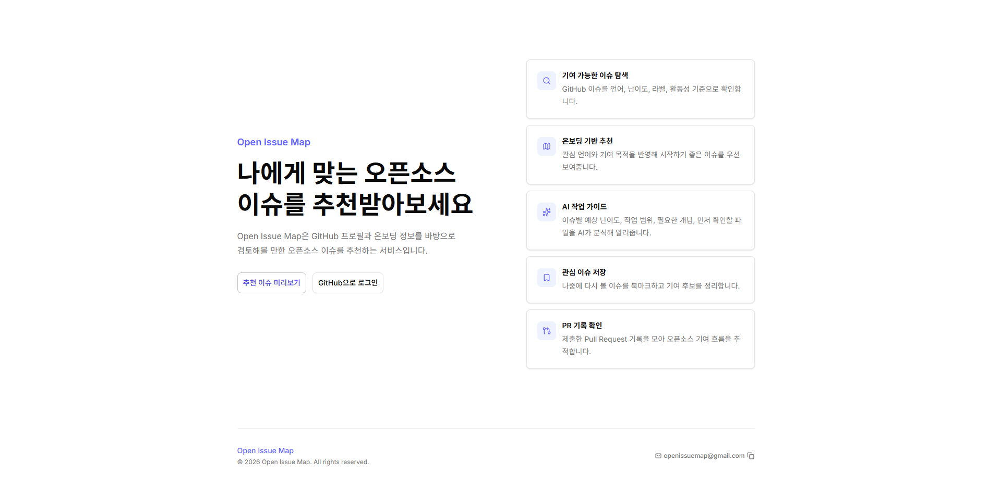
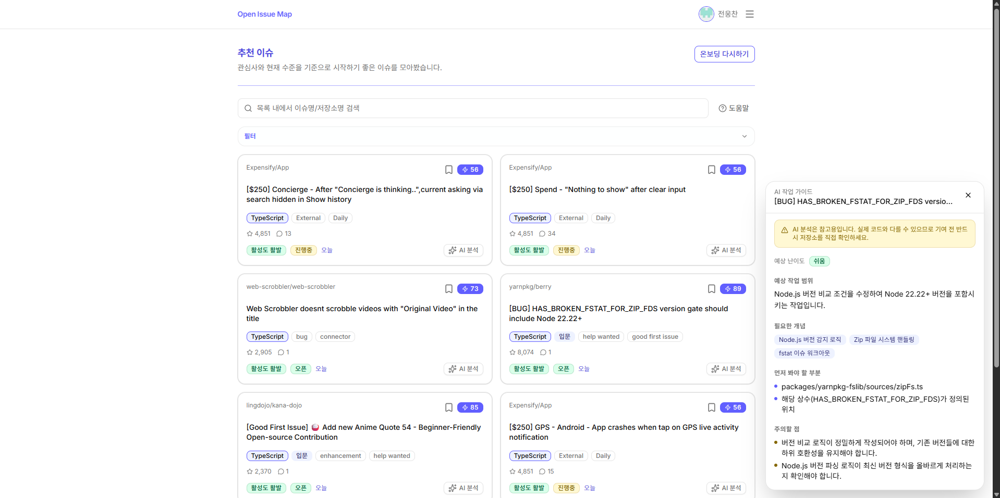

# Open Issue Map

> 오픈소스에 기여하고 싶지만 **어디서 어떻게 시작할지 모르는** 개발자를 위한 이슈 추천 서비스입니다.

**서비스 바로가기:** [https://openissuemap.com](https://openissuemap.com)

---

## 한눈에 보기

GitHub 계정으로 로그인한 뒤 간단한 온보딩 정보를 입력하면, 경험 수준·언어·기여 목적에 맞는 오픈소스 이슈를 추천 점수 순으로 보여줍니다. 관심 이슈는 북마크로 저장하고, AI 분석으로 기여 진입점을 빠르게 파악할 수 있습니다.

## 핵심 기능

| 기능 | 설명 |
| --- | --- |
| **맞춤 이슈 추천** | 언어·난이도·기여유형·경쟁도·시간·목적·저장소 인지도 7개 차원으로 추천 점수 산정 |
| **AI 작업 가이드** | 이슈·사용자 프로필·저장소 README를 종합해 Gemini가 개인화된 기여 가이드를 제공 |
| **북마크** | 관심 이슈 저장. GitHub API 장애 시에도 DB 저장 정보로 목록 유지 |
| **PR 히스토리** | 외부 저장소에 제출한 PR 기록과 통계 확인 |
| **사용자 온보딩** | 경험·언어·기여방식·기여목적을 수집해 추천 기준으로 활용 |

---

## 기술 스택

| 영역 | 기술                                   | 선택 이유 |
| --- |--------------------------------------| --- |
| Framework | Next.js 15 App Router (React 19)     | 서버 컴포넌트·API 서버·인증 보호 페이지를 하나의 앱에서 처리하기 위해 |
| UI | Tailwind CSS v4, shadcn/ui, Radix UI | 접근성 기본값이 갖춰진 컴포넌트와 디자인 토큰 기반 스타일링으로 일관된 UI 구성 |
| Language | TypeScript strict                    | API 응답·추천 점수 모델처럼 데이터 형태가 중요한 영역에서 런타임 오류 예방 |
| Auth | NextAuth v5, GitHub OAuth            | GitHub 로그인 흐름과 세션·토큰 관리를 통합 처리 |
| Database | Neon PostgreSQL                      | 사용자·프로필·북마크처럼 관계가 명확한 데이터를 클라우드 PostgreSQL로 관리 |
| Server State | TanStack Query v5                    | 페이지네이션·캐시·데이터 변경을 화면 컴포넌트에서 분리해 관리 |
| AI | Google Gemini API                    | 이슈 분석에 필요한 자연어 이해와 구조화된 JSON 응답을 저비용으로 처리 |
| Validation | Zod v4                               | API 입력값과 외부 응답을 비즈니스 로직 진입 전에 명시적으로 검증 |
| Test | Vitest                               | 추천 점수·필터·API·인증 로직 단위 테스트 |
| Infra | Vercel, Cloudflare | Vercel (호스팅·CDN·서버리스), Cloudflare (DNS) |

---

## 아키텍처

```text
[ Browser ]
  TanStack Query     — 서버 데이터 캐시 · 무한스크롤
  GitHub OAuth 로그인 — NextAuth 리디렉션 처리
  ↕ fetch / JSON

[ Server ]
  Middleware         — 로그인 여부 · 온보딩 완료 여부 확인 후 페이지 진입 허용 / 차단
  Route Handlers     — GitHub 토큰 검증 · 요청 데이터 형식 검증
    ↕ 함수 호출
  Domain Services
    추천 점수 계산   — 7차원 독립 채점
    서버 캐시        — GitHub 응답 30분 보관
    비로그인 AI 한도 — IP별 일일 횟수 확인 (DB)
  ↕

[ External ]
  GitHub API · Gemini API · Neon PostgreSQL
```
---

## AI 분석 파이프라인

AI 분석 버튼을 누르면 아래 파이프라인이 실행됩니다.

### 입력 데이터

```text
클라이언트 전송 (이슈 카드)
  제목, 본문, 라벨, 언어, 저장소명

서버에서 추가
  경험 수준, 기여 목적, 주당 투입 시간  ← DB (온보딩 프로필)
  저장소 README  ← GitHub API (24시간 저장소별 캐시)
```

### 전처리 — 불필요한 내용 제거로 AI 입력 비용 절약

```text
이슈 본문
  코드블록 → [코드 블록 생략]
  HTML 태그·이미지·링크 URL 제거
  2,000자 제한

저장소 README
  이미지·배지 제거, 링크 URL 제거
  코드블록 유지 (설치·실행 명령은 기여에 직접 필요)
  5,000자 제한
```

### 프롬프트 구성

```text
[역할 및 응답 형식 고정]
역할: 오픈소스 기여 실무 가이드
응답 형식: JSON만 허용
난이도 기준: 이슈 절대 난이도 X — 기여자 수준 대비 상대적 난이도

[실제 전달 내용]
┌─────────────────────────────────────────────┐
│ [기여자 정보]                                │
│ 경험 수준: 초급 (간단한 버그·문서 경험 있음) │
│ 기여 목적: 포트폴리오 구축                   │
│ 주당 투입 가능 시간: 5시간                   │
│                                             │
│ [이슈 정보]                                  │ㄱㅈ３ㅅㄸㅎㅁㅇㄴㄷㅈ윭ㅊ
│ 저장소: facebook/react                       │
│ 주요 언어: TypeScript       (없으면 생략)    │
│ 라벨: bug, good first issue (없으면 생략)    │
│ 제목: Fix login button                      │
│ 이슈 내용: ...전처리된 본문...               │
│                                             │
│ [프로젝트 개요 (README)]   (없으면 생략)      │
│ ...전처리된 README 내용...                   │
└─────────────────────────────────────────────┘
```

### 응답 검증

Gemini에 JSON 형식 응답을 강제하고, 반환값을 즉시 규격대로 받았는지 검증합니다.

```text
검증 항목
  difficulty:     '쉬움' | '보통' | '어려움'
  scope:          string          (예상 작업 범위)
  concepts:       string[]  2~4개 (필요한 개념)
  startingPoints: string[]  2~3개 (먼저 봐야 할 부분)
  cautions:       string[]  1~3개 (주의할 점)
```
---

## 추천 알고리즘 상세

GitHub 이슈 추천은 단순 키워드 매칭으로 해결되지 않습니다. 언어가 맞아도 난이도가 높으면 초심자에게 무의미하고, 난이도가 맞아도 이미 PR이 달렸다면 기여 기회가 없습니다. 이 두 문제를 동시에 해결하기 위해 **7개 차원을 독립적으로 채점하고 합산**하는 방식을 선택했습니다.

### 추천 흐름

1. 온보딩 프로필을 불러옵니다.
2. 선호 언어를 기준으로 GitHub 이슈 후보를 언어별 동시 조회합니다.
3. 중복 이슈를 제거합니다.
4. 이슈 라벨·제목·본문·댓글 수·연결 PR 여부·저장소 정보를 기반으로 점수를 계산합니다.
5. 추천 점수 50점 미만 이슈를 제거합니다.
6. 사용자 필터를 적용하고 반환합니다.

### 점수 산정 기준 (최대 100점)

| 차원 | 최대 점수 | 기준 |
| --- | --- | --- |
| 언어 일치 | 선택 언어 일치 / 계열 언어 / 불일치 |
| 난이도 적합도 | 이슈 라벨로 난이도 추정 후 경험 수준과 비교. 라벨 없으면 경험 수준별 부분 점수 |
| 기여 방식 일치 | 라벨·제목·본문 키워드로 bug / feat / doc / test / review 감지 |
| 경쟁도 | PR 연결 여부·댓글 수로 선점 위험 추정. 경험 수준별 보정 |
| 기여 목적 | 포트폴리오 / 성장 / 커뮤니티 목적에 맞는 이슈 유형·저장소 우대 |
| 투입 가능 시간 | 주당 시간(2h / 5h / 10h)에 맞는 난이도·방식 일치 시 가산 |
| 저장소 인지도 | star 수 구간별 가산 (100 / 300 / 1,000 / 3,000+) |

상세 규칙은 [docs/SCORING_RULES.md](./docs/SCORING_RULES.md)에 정리했습니다.

---

## 인증과 보안 설계

GitHub 접근 토큰은 클라이언트에 노출하지 않습니다.

- GitHub 로그인은 NextAuth가 처리합니다.
- 서버는 서버 전용 보안 쿠키를 기반으로 세션을 생성합니다.
- GitHub API가 필요한 요청은 서버에서 토큰을 꺼내 사용합니다.
- 클라이언트는 내부 API만 호출하고, GitHub API와 DB에는 직접 접근하지 않습니다.

---

## 데이터 모델

| 테이블 | 역할 |
| --- | --- |
| `users` | GitHub 로그인 사용자 기본 정보. GitHub ID를 식별 기준으로 사용 |
| `user_profiles` | 온보딩 설문 결과와 추천 기준 |
| `bookmarks` | 저장한 이슈 정보. GitHub API 장애 시 제목·URL로 목록 표시 |
| `ai_guest_usage` | 비로그인 AI 분석 일일 사용 횟수. IP별 관리, 24시간 후 자동 초기화 |

---

## 화면

### 랜딩



### 온보딩


경험 수준, 기여 유형, 선호 언어, 주간 가능 시간, 기여 목적을 5단계로 입력합니다. GitHub 저장소 언어 정보를 자동으로 가져와 초기 언어 후보를 구성합니다.

### 추천 이슈


추천 점수와 함께 저장소·제목·라벨·댓글 수·스타 수를 표시합니다. 무한스크롤로 이슈를 탐색합니다.

### AI 작업 가이드



이슈 카드의 AI 분석 버튼을 누르면 이슈 내용·사용자 온보딩 프로필·저장소 README를 종합해 Gemini가 분석합니다. 필요한 개념, 예상 작업 범위, 기능 역할 중심의 진입점, 주의사항을 난이도와 함께 제공합니다. 비로그인 사용자는 하루 5회 무료로 사용할 수 있습니다.

### 북마크


북마크 토글은 즉시 반응합니다. 저장 시점의 제목·URL을 DB에 보관해 GitHub API 장애 시에도 목록 확인이 가능합니다.

### PR 히스토리


본인 소유 저장소 PR을 제외한 오픈소스 기여 PR 이력을 보여줍니다.

### 마이페이지


GitHub 계정 정보, 온보딩 설정, 북마크/PR 활동 요약을 확인합니다.

---

## 문서

- [추천 점수 규칙](./docs/SCORING_RULES.md)
- [DB 스키마](./docs/DB_SCHEMA.md)
- [API 명세](./docs/API.md)
