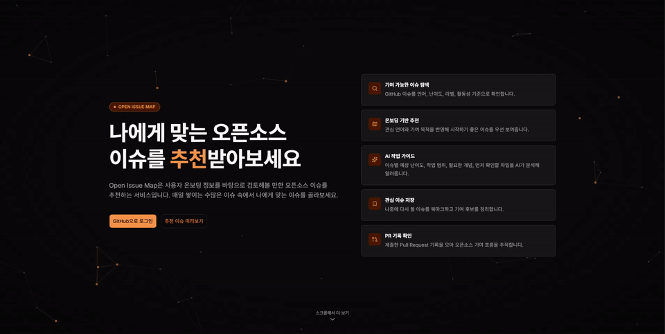
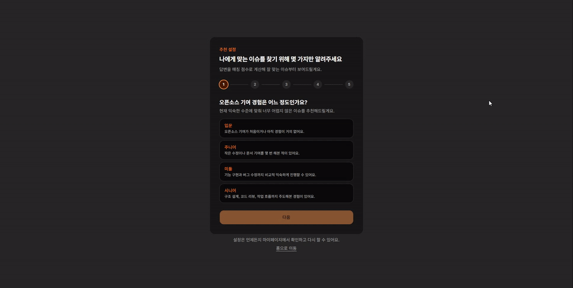
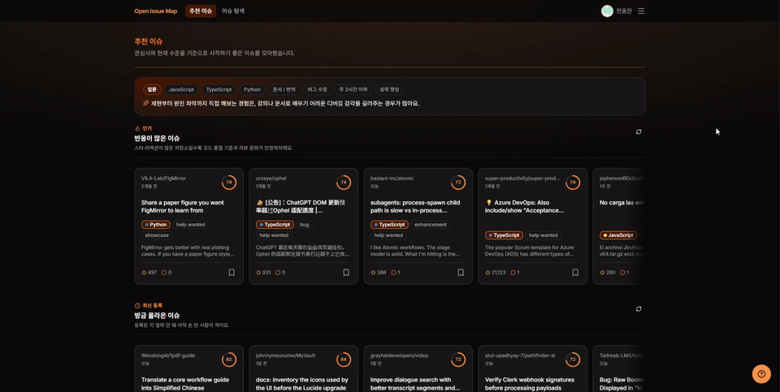
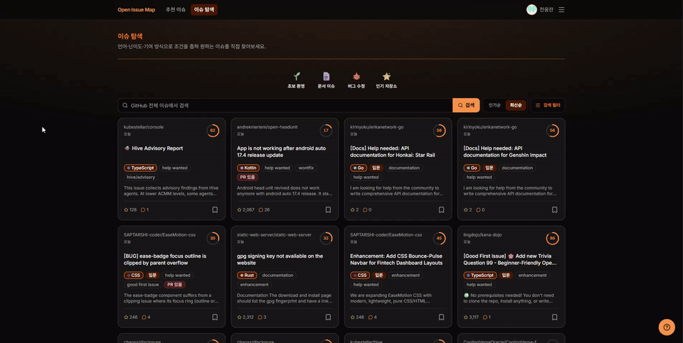
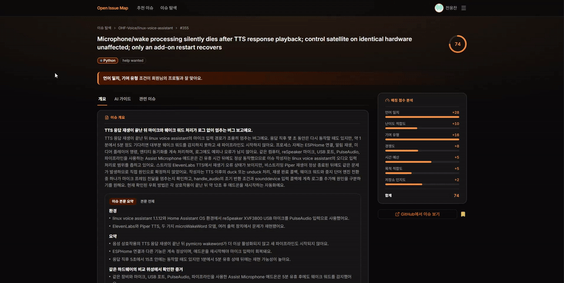
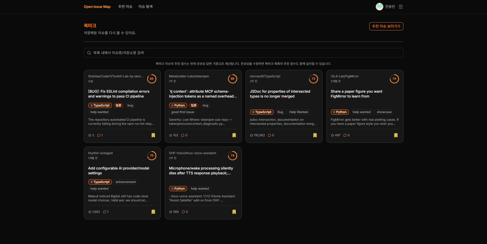
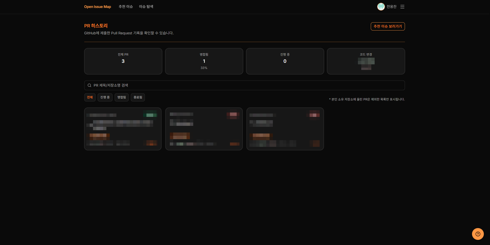
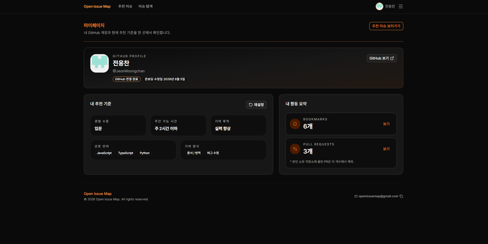

# Open Issue Map

> 오픈소스에 기여하고 싶지만 **어디서 어떻게 시작할지 모르는** 개발자를 위한 이슈 추천 서비스입니다.

**서비스 바로가기:** [https://openissuemap.com](https://openissuemap.com)

---

## 한눈에 보기

로그인하지 않아도 추천 이슈와 GitHub 전체 이슈를 둘러볼 수 있습니다. GitHub 계정으로 로그인하고 온보딩을 완료하면 경험 수준·선호 언어·기여 방식·주간 가능 시간·기여 목적을 바탕으로 이슈별 매칭 점수를 계산합니다. 상세 페이지에서는 이슈 원문과 저장소 문서를 함께 분석한 AI 가이드로 실제 기여 진입점을 확인할 수 있습니다.

## 핵심 기능

| 기능 | 설명 |
| --- | --- |
| **맞춤 이슈 추천** | 미리 수집한 인기·최신 후보 풀에 사용자 프로필을 적용해 70점 이상 이슈를 캐러셀로 추천 |
| **GitHub 이슈 탐색** | 자유 검색, 인기순·최신순 정렬, 언어·난이도·기여 방식·진행 상태·스타·점수 필터와 자동 무한스크롤 제공 |
| **추천 점수** | 언어·난이도·기여 방식·경쟁도·시간·목적·저장소 인지도 7개 차원을 합산해 100점 만점으로 산정 |
| **이슈 상세·AI 가이드** | 이슈 원문, 관련 이슈, 점수 근거, 저장소 README·CONTRIBUTING을 종합한 개인화 작업 가이드 제공 |
| **북마크** | 저장 시점의 이슈 카드 데이터를 DB에 스냅샷으로 보관해 GitHub 재조회 없이 빠르게 목록 표시 |
| **PR 히스토리** | 본인 소유 저장소를 제외한 외부 저장소 PR 기록과 상태·요약 통계 제공 |

---

## 기술 스택

| 영역 | 기술                                   | 선택 이유 |
| --- |--------------------------------------| --- |
| Framework | Next.js 15 App Router (React 19)     | 서버 컴포넌트·API 서버·인증 보호 페이지를 하나의 앱에서 처리하기 위해 |
| UI | Tailwind CSS v4, shadcn/ui, Radix UI | 접근성 기본값이 갖춰진 컴포넌트와 디자인 토큰 기반 스타일링으로 일관된 UI 구성 |
| Language | TypeScript strict                    | API 응답·추천 점수 모델처럼 데이터 형태가 중요한 영역에서 런타임 오류 예방 |
| Auth | NextAuth v5, GitHub OAuth            | GitHub 로그인 흐름과 세션·토큰 관리를 통합 처리 |
| Database | Neon PostgreSQL                      | 사용자·프로필·북마크처럼 관계가 명확한 데이터를 클라우드 PostgreSQL로 관리 |
| Server State | TanStack Query v5                    | 페이지네이션·캐시·데이터 변경을 화면 컴포넌트에서 분리해 관리 |
| AI | OpenAI API                           | 이슈 분석에 필요한 자연어 이해와 Structured Outputs 기반 구조화된 JSON 응답을 저비용으로 처리 |
| Validation | Zod v4                               | API 입력값과 외부 응답을 비즈니스 로직 진입 전에 명시적으로 검증 |
| Test | Vitest                               | 추천 점수·필터·API·인증 로직 단위 테스트 |
| Automation | GitHub Actions | 인기 후보는 12시간, 최신 후보는 3시간마다 언어별로 수집 |
| Infra | Vercel, Cloudflare | Vercel로 앱·서버리스 API를 배포하고 Cloudflare에서 DNS 관리 |

---

### AI 도구 활용 방안

| 구분 | 활용 방식 및 목적 | 이 서비스에서의 활용 예시 |
| ---------------------- | --- | --- |
| AI 개발 도구 활용 | 컴포넌트 초안 생성, 코드 리팩토링, 테스트 케이스 작성, 문서 정리 등 반복적인 작업의 생산성 향상 | 정해진 공통 컴포넌트를 활용한 합성 컴포넌트 초안 작성, 추천 점수 계산 로직 테스트 케이스 작성 |
| 역할 기반 에이전트 활용 | 사용자·테스터·시니어 개발자·CTO 등의 역할을 부여해 설계 방향과 트레이드오프를 다각도로 검토. 단일 관점에 치우치지 않는 의사결정 보조 | 오픈소스 기여 초심자가 이슈를 고르는 흐름, 추천 결과에 표시할 정보의 우선순위, 기능개발 우선순위 검토 |
| 개발자 주도 의사결정 | AI가 제시한 대안과 트레이드오프를 참고하되, 서비스 방향성과 아키텍처에 관한 핵심 설계는 직접 결정. AI 의존도 제어와 설계 책임 유지 | 추천 점수 산정 기준, GitHub 이슈 필터링 기준, 서버·클라이언트 캐싱 적용 범위, 배포 환경과 운영 방식 결정 |

---

## 아키텍처

```text
[ Browser ]
  TanStack Query       — 이슈 탐색·북마크·PR 목록 캐시와 무한스크롤
  React Server Components — 추천 레일·이슈 상세의 초기 데이터 렌더링
  GitHub OAuth         — NextAuth 로그인과 온보딩 상태 연결
  ↕ fetch / JSON

[ Server ]
  Route Handlers       — 인증·입력 검증, GitHub/OpenAI 호출 경계
  Domain Services
    추천 큐레이션     — DB 후보 풀 로드 → 7차원 채점 → 저장소 편중 제거
    이슈 탐색         — GitHub 전체 검색 → 후처리 필터 → 자동 무한스크롤
    AI 가이드         — 이슈·README·CONTRIBUTING 분석 → 구조화 응답
    캐시              — GitHub 검색 30분, README 24시간, 기여 문서 7일
  ↕ SQL / HTTPS

[ Background ]
  GitHub Actions       — 인기 12시간 / 최신 3시간 주기로 후보 풀 갱신
  Cron Route           — 언어·조건별 GitHub 후보를 PostgreSQL에 저장

[ External ]
  GitHub GraphQL/REST API · OpenAI API · PostgreSQL
```
---

## AI 분석 파이프라인

이슈 상세 페이지에 진입하면 아래 파이프라인이 실행됩니다. 같은 사용자와 이슈 조합의 유효한 분석 결과가 DB에 있으면 OpenAI를 다시 호출하지 않고 즉시 반환합니다.

### 입력 데이터

```text
상세 페이지에서 전달
  제목, 전체 본문, 라벨, 언어, 저장소명, 이슈 번호·수정 시각

서버에서 추가
  경험 수준, 기여 목적, 주당 투입 시간  ← DB 사용자 온보딩 정보
  저장소 README                       ← GitHub API
  CONTRIBUTING 원문                   ← GitHub API
  CONTRIBUTING·PR 템플릿의 실제 경로  ← GitHub API
```

### 전처리 — 불필요한 내용 제거로 AI 입력 비용 절약

```text
이슈 본문
  HTML 주석·태그, 이미지, 링크 URL, 템플릿 체크박스 제거

저장소 README·CONTRIBUTING
  이미지·배지 제거, 링크 URL 제거
  코드블록 유지 (설치·실행 명령은 기여에 직접 필요)
```

### 프롬프트 구성

```text
[역할 및 응답 형식 고정]
역할: 오픈소스 기여 실무 가이드
응답 형식: JSON만 허용

[실제 전달 내용]
┌─────────────────────────────────────────────┐
│ [기여자 정보]                                │
│ 경험 수준: 초급 (간단한 버그·문서 경험 있음) │
│ 기여 목적: 포트폴리오 구축                   │
│ 주당 투입 가능 시간: 5시간                   │
│                                             │
│ [이슈 정보]                                  │
│ 저장소: facebook/react                       │
│ 주요 언어: TypeScript       (없으면 생략)    │
│ 라벨: bug, good first issue (없으면 생략)    │
│ 제목: Fix login button                      │
│ 이슈 내용: ...전처리된 본문...               │
│                                             │
│ [README]                  (없으면 생략)       │
│ ...전처리된 README 내용...                   │
│                                             │
│ [CONTRIBUTING 원문]       (없으면 생략)       │
│ ...전처리된 기여 문서 내용...                │
└─────────────────────────────────────────────┘
```

### 응답 검증

OpenAI Structured Outputs로 응답 형태(키·타입)를 API 레벨에서 강제하고, 반환값을 zod 스키마로 한 번 더 검증합니다.

```text
검증 항목
  issueOverview:             이슈 한 줄 요약·상세 분석·원문 섹션별 요약
  scope:                     예상 작업 범위와 의심되는 코드 영역
  concepts:                  필요한 핵심 기술·개념
  startingPoints:            먼저 확인할 파일·모듈
  cautions:                  엣지 케이스와 주의사항
  expectedBenefit:           기여자의 학습 효과와 프로젝트에 주는 이점
  contributionGuideInsight: 커밋 컨벤션·CLA 요구사항 분석
  contributionRules:        실제로 확인한 CONTRIBUTING·PR 템플릿 경로
```

CONTRIBUTING과 PR 템플릿의 경로는 AI가 추측하지 않고 서버가 GitHub에서 직접 확인합니다. AI 응답은 OpenAI Structured Outputs로 키와 타입을 강제한 뒤 Zod로 배열 길이와 필수 값을 다시 검증합니다. 비로그인 사용자는 캐시가 없는 분석을 IP 기준 하루 3회까지 생성할 수 있습니다.

---

## 추천 알고리즘 상세

GitHub 이슈 추천은 단순 키워드 매칭으로 해결되지 않습니다. 언어가 맞아도 난이도가 높으면 초심자에게 무의미하고, 난이도가 맞아도 이미 PR이 달렸다면 기여 기회가 없습니다. 이 두 문제를 동시에 해결하기 위해 **7개 차원을 독립적으로 채점하고 합산**하는 방식을 선택했습니다.

### 추천 페이지

1. GitHub Actions가 13개 언어의 인기·최신 이슈 후보를 주기적으로 수집합니다.
2. Cron Route가 원본 후보 풀을 `(language, condition)` 단위로 PostgreSQL에 저장합니다.
3. 페이지 요청 시 사용자의 선호 언어에 해당하는 후보 풀을 읽고 중복을 제거합니다.
4. 사용자 프로필로 점수를 계산하고 70점 미만 이슈를 제거합니다.
5. 한 저장소가 레일을 독점하지 않도록 저장소당 최대 3개만 남깁니다.
6. 인기 이슈와 최신 이슈를 각각 최대 15개씩 캐러셀로 반환합니다.

느린 GitHub 후보 수집과 빠른 개인화 계산을 분리했기 때문에 페이지 진입 시 GitHub 검색을 반복하지 않습니다. `새로 추천받기`는 같은 품질 기준을 통과한 후보를 다시 샘플링해 다른 조합을 보여줍니다.

### 이슈 탐색

1. 검색어·언어·정렬 조건을 GitHub 검색 쿼리로 전달합니다.
2. GitHub 검색에서 직접 지원하지 않는 난이도·진행 상태·기여 방식·최소 스타·최소 점수는 응답 후 적용합니다.
3. 자유 검색어가 없는 공개 탐색 결과는 사용자와 무관한 키로 30분간 공유 캐시합니다.
4. 기본·필터 탐색은 첫 30개를 빠르게 응답하면서 90개 결과를 백그라운드에서 미리 채웁니다.
5. 캐시된 목록이 소진되기 전에 다음 GitHub 커서 배치를 프리페치해 자동 무한스크롤을 이어갑니다.

### 점수 산정 기준 (최대 100점)

| 차원 | 최대 점수 | 기준 |
| --- | --- | --- |
| 언어 일치 | 28 | 선택 언어 일치 / 계열 언어 / 불일치 |
| 난이도 적합도 | 23 | 이슈 라벨로 난이도를 추정해 경험 수준과 비교. 라벨이 없으면 경험 수준별 부분 점수 |
| 기여 방식 일치 | 16 | 라벨·제목·본문 키워드로 bug / feat / doc / test / review 감지 |
| 경쟁도 | 8 | PR 연결 여부·댓글 수로 선점 위험을 추정하고 경험 수준별로 보정 |
| 기여 목적 | 14 | 포트폴리오 / 성장 / 커뮤니티 목적에 맞는 이슈 유형·저장소 우대 |
| 투입 가능 시간 | 7 | 주당 시간(2h / 5h / 10h)에 맞는 난이도·방식 일치 시 가산 |
| 저장소 인지도 | 4 | 스타 수 구간별 가산 (100 / 300 / 1,000 / 3,000+) |

---

## 인증과 보안 설계

GitHub 접근 토큰은 클라이언트에 노출하지 않습니다.

- GitHub 로그인은 NextAuth가 처리합니다.
- 서버는 서버 전용 보안 쿠키를 기반으로 세션을 생성합니다.
- GitHub API가 필요한 요청은 서버에서 토큰을 꺼내 사용합니다.
- 클라이언트는 내부 API만 호출하고, GitHub API와 DB에는 직접 접근하지 않습니다.

---

## 데이터 모델(PostgreSQL)

| 테이블 | 역할 |
| --- | --- |
| `users` | GitHub 로그인 사용자 기본 정보. GitHub ID를 식별 기준으로 사용 |
| `user_profiles` | 온보딩 설문 결과와 추천 기준 |
| `bookmarks` | 북마크 시점의 이슈 카드 전체 데이터를 스냅샷으로 저장 |
| `onboarding_advice` | 기여 방식·목적 조합별 대시보드 조언 문구 풀 |
| `recommendation_candidate_pools` | 언어·추천 조건별 GitHub 이슈 원본 후보 풀 |
| `issue_ai_guides` | 사용자·이슈별 AI 분석 결과와 분석 당시 이슈 수정 시각 |
| `ai_guest_usage` | 비로그인 AI 분석 일일 사용 횟수. IP별 관리, 24시간 후 자동 초기화 |

---

## 화면

### 랜딩
서비스의 온보딩·추천 점수·AI 가이드 흐름을 실제 UI 컴포넌트로 미리 보여줍니다. 로그인하지 않아도 추천 이슈 미리보기로 이동할 수 있고, GitHub 계정으로 바로 로그인할 수 있습니다.




### 온보딩
경험 수준, 기여 방식, 선호 언어, 주간 가능 시간, 기여 목적을 5단계로 입력합니다. GitHub 저장소의 언어 정보를 불러와 선호 언어를 자동 선택하며 완료한 답변은 추천 점수와 개인화 조언의 기준으로 사용합니다.




### 추천 이슈
사용자의 온보딩 프로필로 70점 이상을 받은 이슈를 `인기`와 `최신` 두 개의 캐러셀로 보여줍니다. 레일별 새로 추천받기 버튼으로 다른 조합을 불러올 수 있습니다. 로그인 사용자는 상단에서 현재 추천 기준과 기여 목적에 맞는 조언도 확인할 수 있습니다.




### 이슈 탐색


GitHub 전체 공개 이슈를 검색하고 무한스크롤로 탐색합니다. 초보 환영·문서·버그·인기 저장소 빠른 프리셋과 인기순·최신순 정렬을 제공하며, 언어·난이도·기여 방식·진행 상태·최소 스타·최소 점수 조건을 조합할 수 있습니다.

### 이슈 상세(AI 가이드)



이슈에 진입하면 OpenAI가 이슈 원문, 사용자 프로필, 저장소 README와 CONTRIBUTING 문서를 자동으로 분석합니다. `개요`, `AI 가이드`, `관련 이슈` 탭에서 원문 요약, 실제 기여 규칙, 필요한 개념, 작업 범위, 시작 지점, 주의사항과 기대 효과를 확인할 수 있습니다. 사이드바에는 7개 차원의 매칭 점수 근거와 GitHub 이동·북마크 액션을 제공합니다.

### 북마크



관심 이슈를 저장하고 제목이나 저장소명으로 검색할 수 있습니다.

### PR 히스토리



본인 소유 저장소를 제외한 오픈소스 Pull Request 기록을 보여줍니다. 전체 PR, 병합 수와 병합률, 진행 중 PR, 코드 추가·삭제량을 요약하고 제목·저장소 검색과 상태 필터를 제공합니다.

### 마이페이지



GitHub 계정 정보와 현재 추천 기준을 한 곳에서 확인합니다. 온보딩을 다시 설정할 수 있고, 북마크와 Pull Request 활동 개수에서 각 목록으로 이동할 수 있습니다.

---
